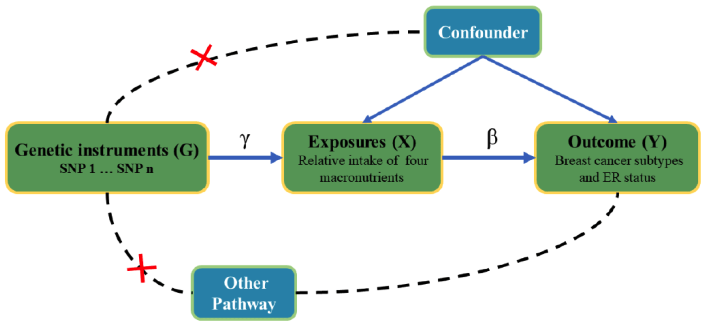
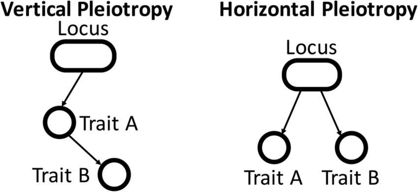
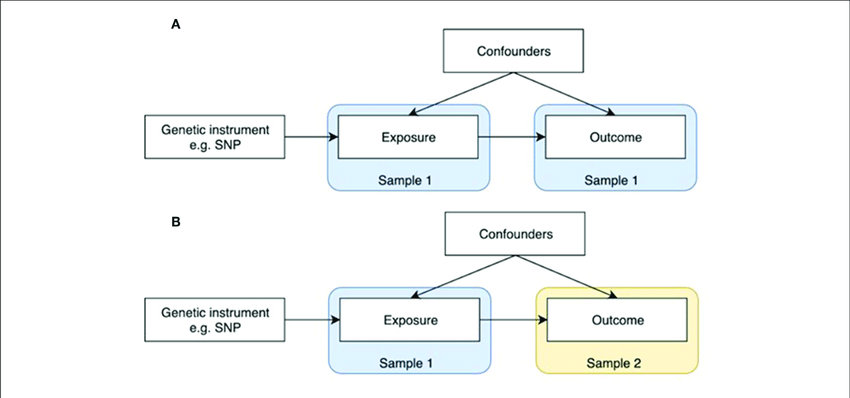

# Mendelian-Randomization (MR)
Statistical method that uses genetic variants (Instrumental Variables) as proxies for environmental and lifestyle exposure to find evidence of causal inference between a risk factor and a disease

  

**Assumptions of MR :**
1. The genetic variant is associated with the risk factor.
2. The effect of the genetic variant on the risk factor is independent of the confounding factors.
3. There are no direct pathways through which the genetic factor is directly related to the outcome being studied.

A genetic variant becomes an **Instrumental Variable (IV)** when all the above assumptions are satisfied. These IV's are used to study the causal relation between the risk factor and the outcome using MR methods.

## Pleiotropy 

It is a phenomenon where a single genetic variant influences multiple traits.
There are two types of pleiotropy:
1. **Vertical Pleiotropy**: This occurs when a genetic variant (SNP) influences one trait, which subsequently affects another trait along a downstream pathway to the outcome. However, it's important to note that it's not necessarily the SNP itself that influences the second trait, but rather the first trait affected by the SNP that influences the second trait.
2. **Horizontal Pleiotropy**: This occurs when a genetic variant affects the outcome through pathways independent of the risk factor. This violates assumption 3 of Mendelian Randomization, which assumes there are no direct pathways between the genetic variant and the outcome, except through the risk factor.
 

  

## Types of MR
There are two different types of Mendelian Randomization :
1. **One Sample MR**: This occurs when both the risk factor and the outcome are derived from the same sample population.  
   Advantages :  
   * Allows for direct assessment of the relationship between the genetic variant, risk factor, and outcome within the same population, minimizing potential biases introduced by population heterogeneity.  
   Disadvantages :  
   * Limited Generalizability: Findings may be specific to the population from which the data is derived, limiting the applicability of results to other populations.
   * Susceptible to Population Stratification: Population stratification within a single sample can introduce bias if not properly accounted for, potentially confounding the  relationship between the genetic variant, risk factor, and outcome.
 

2. **Two Sample MR**: In this scenario, the risk factor and the outcome are obtained from two separate sample populations.
   Advantages :  
   * Offers the advantage of leveraging large-scale genetic data from different cohorts, potentially increasing statistical power and generalizability of findings across diverse populations. Additionally, it allows for validation of results across independent datasets, enhancing the robustness of the analysis.  
   Disadvantages :  
   * Potential for Bias: Differences in study design, measurement methods, and population characteristics between the two samples can introduce bias if not adequately controlled for, potentially impacting the validity of causal inference.
   * Difficulty in Harmonization: Integrating data from different sources may pose challenges in standardizing variables, matching populations, and accounting for confounding factors, leading to methodological complexities and potential errors in analysis.

 

  

## Methods for MR

